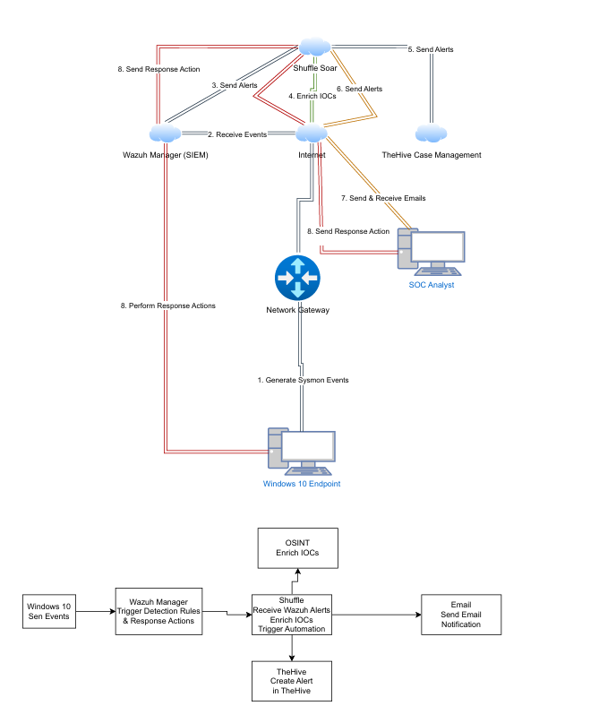
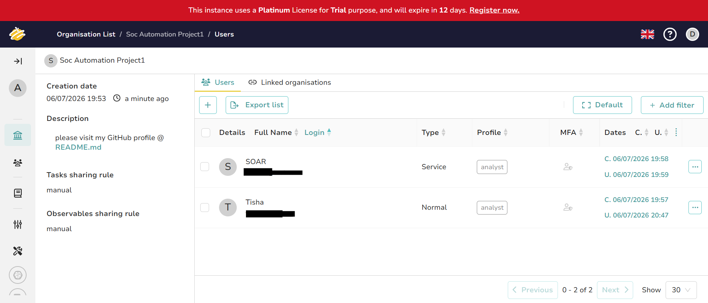
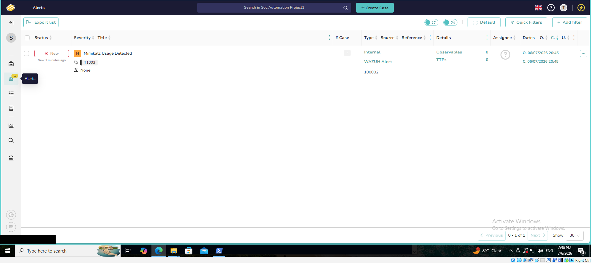

This guide documents how I deployed **TheHive 5.7.3** on **Ubuntu Server 24.04.4 LTS** hosted on **Vultr** as part of my **SOC Automation Using Wazuh** project.

TheHive serves as the incident response and case management platform within the SOC environment. Alerts generated by Wazuh are forwarded to **Shuffle SOAR**, enriched using **VirusTotal**, and automatically created as alerts in TheHive for analyst investigation.

> **Reference**
>
> This deployment follows the official StrangeBee standalone installation guide and was adapted for my lab environment.
>
> https://docs.strangebee.com/thehive/installation/installation-guide-linux-standalone-server/

## Environment

| Component | Version |
|----------|---------|
| Operating System | Ubuntu 24.04.4 LTS |
| TheHive | 5.7.3-1 |
| Apache Cassandra | 4.1.11 |
| Elasticsearch | 8.14.3 |
| Java | OpenJDK 11.0.31 Amazon Corretto |
| TheHive Port | 9000 |

---

## Architecture

<p align="center">
  
</p>

<p align="center">
  <em><strong>Figure 1.</strong> SOC automation architecture showing Wazuh, Shuffle SOAR, VirusTotal, TheHive, and email notification integration.</em>
</p>

---

## Step 1 — Install Dependencies

Update the server.

```bash
sudo apt update && sudo apt upgrade -y
```

Install required dependencies.

```bash
sudo apt install wget gnupg apt-transport-https git ca-certificates ca-certificates-java curl software-properties-common python3-pip lsb-release -y
```

---

## Step 2 — Install Java

TheHive requires Java. In this project, **Amazon Corretto OpenJDK 11** was used.

Add the Amazon Corretto key.

```bash
wget -qO- https://apt.corretto.aws/corretto.key | sudo gpg --dearmor -o /usr/share/keyrings/corretto.gpg
```

Add the Corretto repository.

```bash
echo "deb [signed-by=/usr/share/keyrings/corretto.gpg] https://apt.corretto.aws stable main" | sudo tee -a /etc/apt/sources.list.d/corretto.sources.list
```

Install Java.

```bash
sudo apt update
sudo apt install java-common java-11-amazon-corretto-jdk -y
```

Set `JAVA_HOME`.

```bash
echo JAVA_HOME="/usr/lib/jvm/java-11-amazon-corretto" | sudo tee -a /etc/environment
export JAVA_HOME="/usr/lib/jvm/java-11-amazon-corretto"
```

Verify Java.

```bash
java -version
```

Expected version from my deployment:

```text
openjdk version "11.0.31" 2026-04-21 LTS
OpenJDK Runtime Environment Corretto-11.0.31.11.1
OpenJDK 64-Bit Server VM Corretto-11.0.31.11.1
```

---

## Step 3 — Install Apache Cassandra

Cassandra is used by TheHive as a database backend.

Add the Cassandra repository key.

```bash
wget -qO - https://downloads.apache.org/cassandra/KEYS | sudo gpg --dearmor -o /usr/share/keyrings/cassandra-archive.gpg
```

Add the Cassandra repository.

```bash
echo "deb [signed-by=/usr/share/keyrings/cassandra-archive.gpg] https://debian.cassandra.apache.org 40x main" | sudo tee -a /etc/apt/sources.list.d/cassandra.sources.list
```

Install Cassandra.

```bash
sudo apt update
sudo apt install cassandra -y
```

Enable and start Cassandra.

```bash
sudo systemctl enable cassandra
sudo systemctl start cassandra
```

Verify Cassandra.

```bash
sudo systemctl status cassandra
```

Check the Cassandra version.

```bash
cqlsh -e "SHOW VERSION"
```

Version used in this project:

```text
ReleaseVersion: 4.1.11
```

---

## Step 4 — Install Elasticsearch

TheHive relies on Elasticsearch for indexing and searching case data.

During my deployment, installing Elasticsearch from the official repository initially installed **Elasticsearch 8.19.18**.

Although the installation completed successfully, I experienced compatibility issues with **TheHive 5.7.3**.

To resolve this, I downgraded Elasticsearch to **version 8.14.3**, which is the version used throughout this project.

### Initial Elasticsearch Version

```text
8.19.18
```

### Final Elasticsearch Version

```text
8.14.3
```

---

### Add the Elasticsearch Repository

```bash
wget -qO - https://artifacts.elastic.co/GPG-KEY-elasticsearch | sudo gpg --dearmor -o /usr/share/keyrings/elasticsearch-keyring.gpg
```

```bash
echo "deb [signed-by=/usr/share/keyrings/elasticsearch-keyring.gpg] https://artifacts.elastic.co/packages/8.x/apt stable main" | sudo tee /etc/apt/sources.list.d/elastic-8.x.list
```

Update packages.

```bash
sudo apt update
```

Install Elasticsearch.

```bash
sudo apt install elasticsearch
```

Verify the installed version.

```bash
/usr/share/elasticsearch/bin/elasticsearch --version
```

Output:

```text
8.19.18
```

---

### Downgrade Elasticsearch

To maintain compatibility with **TheHive 5.7.3**, I downgraded Elasticsearch from **8.19.18** to **8.14.3**.

After downgrading, verify the version.

```bash
/usr/share/elasticsearch/bin/elasticsearch --version
```

Expected output:

```text
8.14.3
```

Enable Elasticsearch.

```bash
sudo systemctl enable elasticsearch
```

Start Elasticsearch.

```bash
sudo systemctl start elasticsearch
```

Verify the service.

```bash
sudo systemctl status elasticsearch
```

---

## Step 5 — Configure Elasticsearch JVM Options

Create a JVM options file.

```bash
sudo nano /etc/elasticsearch/jvm.options.d/jvm.options
```

Add the following:

```text
-Dlog4j2.formatMsgNoLookups=true
-Xms2g
-Xmx2g
```

Restart Elasticsearch.

```bash
sudo systemctl restart elasticsearch
```

---

## Step 6 — Install TheHive 5.7.3

Add the StrangeBee repository key.

```bash
wget -O- https://archives.strangebee.com/keys/strangebee.gpg | sudo gpg --dearmor -o /usr/share/keyrings/strangebee-archive-keyring.gpg
```

Add the StrangeBee repository.

```bash
echo 'deb [signed-by=/usr/share/keyrings/strangebee-archive-keyring.gpg] https://deb.strangebee.com thehive-5.7 main' | sudo tee -a /etc/apt/sources.list.d/strangebee.list
```

Install TheHive.

```bash
sudo apt update
sudo apt install thehive -y
```

Enable and start TheHive.

```bash
sudo systemctl enable thehive
sudo systemctl start thehive
```

Verify TheHive.

```bash
sudo systemctl status thehive
```

Version installed in this project:

```text
thehive 5.7.3-1
```

---

## Step 7 — Access TheHive Web Interface

TheHive runs on port **9000** by default.

Open a browser and visit:

```text
http://<THEHIVE_SERVER_IP>:9000
```

<p align="center">
  
</p>

<p align="center">
  <em><strong>Figure 2.</strong> TheHive login page confirming the platform was successfully deployed.</em>
</p>

---

## Step 8 — Default Login Credentials

The default credentials are:

| Username | Password |
|----------|----------|
| admin@thehive.local | secret |

> **Important:** Change the default password after logging in for the first time.

---

## Step 9 — Create TheHive Users

A dedicated user/service account was created for Shuffle SOAR integration. This allows Shuffle to authenticate with TheHive and automatically create alerts.

<p align="center">
  
</p>

<p align="center">
  <em><strong>Figure 3.</strong> TheHive users configuration showing the service account used by Shuffle SOAR.</em>
</p>

---

## Step 10 — Verify Alert Creation

After integrating TheHive with Shuffle, I verified that Wazuh alerts were automatically created inside TheHive.

<p align="center">
  
</p>

<p align="center">
  <em><strong>Figure 4.</strong> TheHive alert automatically created after Shuffle processed the Wazuh Mimikatz detection.</em>
</p>

---

## Verification Commands

Useful commands used during troubleshooting and verification:

```bash
lsb_release -a
```

```bash
dpkg -l | grep thehive
```

```bash
dpkg -l | grep cassandra
```

```bash
java -version
```

```bash
curl http://localhost:9000
```

```bash
sudo systemctl status thehive
```

```bash
sudo systemctl status cassandra
```

```bash
sudo systemctl status elasticsearch
```

---

## Troubleshooting

During deployment I encountered several compatibility and configuration issues.

### Elasticsearch Version Compatibility

Installing Elasticsearch from the official Elastic repository initially installed **version 8.19.18**.

This version was not compatible with my TheHive deployment.

To resolve the issue, I downgraded Elasticsearch to **8.14.3**, after which TheHive started successfully and communicated correctly with Elasticsearch.

### Additional Verification

During deployment I verified:

- Cassandra service status
- Elasticsearch service status
- Java runtime configuration
- TheHive service status
- Access to the web interface on port 9000
- Shuffle authentication using a dedicated service account
- Automatic alert creation in TheHive

---

## References

The following official documentation was used during deployment.

- StrangeBee TheHive Documentation
  https://docs.strangebee.com/thehive/

- Standalone Installation Guide
  https://docs.strangebee.com/thehive/installation/installation-guide-linux-standalone-server/

- Elasticsearch Configuration
  https://docs.strangebee.com/thehive/installation/installation-guide-linux-standalone-server/#step-4-install-configure-elasticsearch
---

## Next Step

Continue to
v➡ **02-Install-Wazuh.md**
