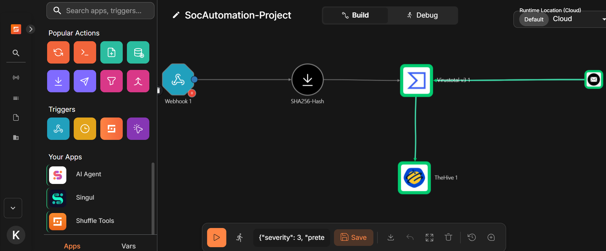
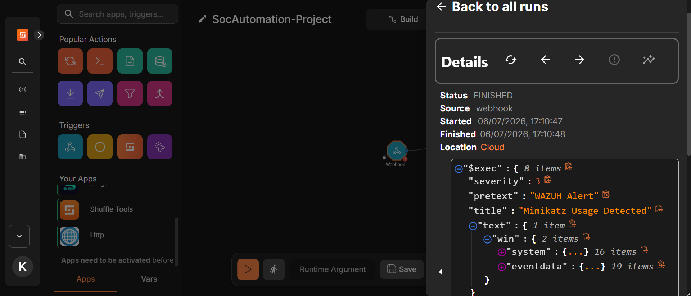
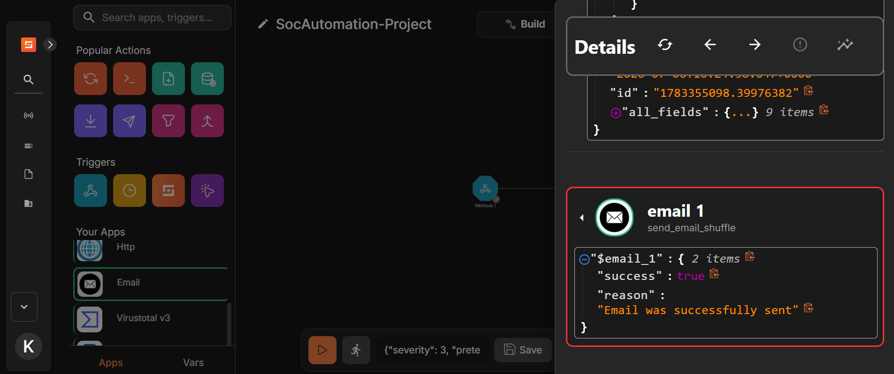
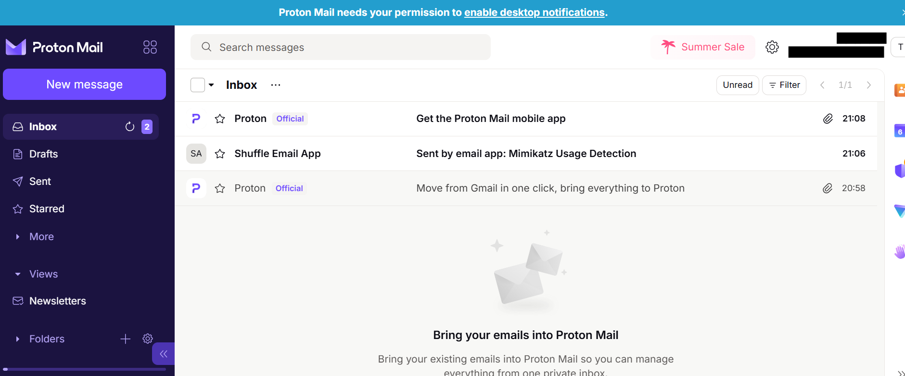

# Configuring Shuffle SOAR

This guide documents how I configured **Shuffle SOAR** to automate the incident response workflow in my SOC Automation project.

Instead of reproducing the official Shuffle documentation, I followed the official documentation and focused on documenting my workflow configuration and verification.

> **Official Documentation**
>
> https://shuffler.io/docs

---

## Architecture

  

  <em><strong>Figure 1.</strong> SOC automation architecture showing Wazuh, Shuffle SOAR, VirusTotal, TheHive, and email notification integration.</em>

---

## Workflow Overview

The Shuffle workflow automates the incident response process after Wazuh detects suspicious activity.

Workflow:

- Receive alerts from Wazuh via Webhook
- Extract the SHA-256 hash
- Query VirusTotal for IOC enrichment
- Create an alert in TheHive
- Send an email notification to the SOC analyst

  

  <em><strong>Figure 2.</strong> Shuffle workflow used to automate alert enrichment and incident response.</em>

---

## Webhook Configuration

The workflow is triggered automatically when Wazuh sends an alert to the configured webhook.

  

  <em><strong>Figure 3.</strong> Shuffle receiving a webhook from Wazuh.</em>

---

## Email Notification

After processing the alert, Shuffle sends an email notification to the analyst.

  

  <em><strong>Figure 4.</strong> Successful execution of the email notification action.</em>

The email received by the analyst confirms the workflow executed successfully.

  

  <em><strong>Figure 5.</strong> Email notification generated by the Shuffle workflow.</em>

---

## TheHive Integration

Shuffle automatically creates an alert in TheHive after enriching the Wazuh alert.

  

  <em><strong>Figure 6.</strong> Alert automatically created in TheHive after the Shuffle workflow completed.</em>

---

## Verification

To validate the workflow, I executed **Mimikatz** on the Windows endpoint.

The workflow successfully:

- Received the Wazuh alert
- Enriched the IOC using VirusTotal
- Created an alert in TheHive
- Sent an email notification to the SOC analyst

---

## References

- Shuffle Documentation  
  https://shuffler.io/docs

---

## Next Step

With the automation workflow configured, the final stage of the project is validating the complete detection and response pipeline.

➡ Continue to **04-End-to-End-Automation.md**
