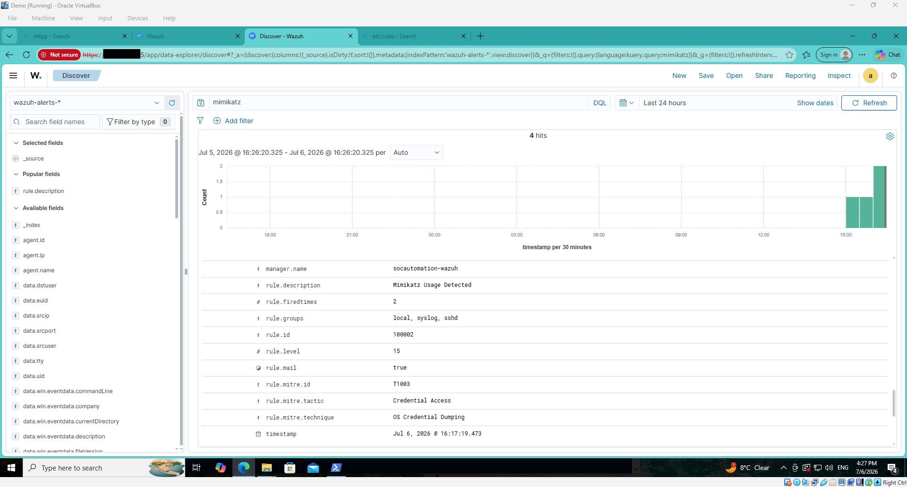
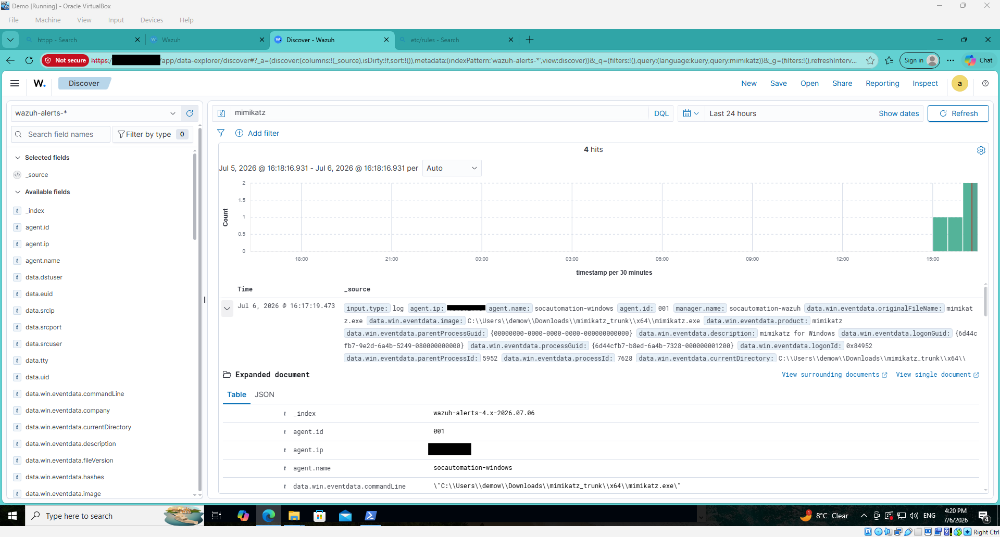

# End-to-End SOC Automation Validation

This guide demonstrates the complete detection and response workflow implemented throughout this project.

To validate the SOC automation pipeline, I executed **Mimikatz** on the Windows endpoint. The activity was detected by Wazuh, processed by Shuffle SOAR, enriched with VirusTotal, forwarded to TheHive, and an email notification was sent automatically.

---

## Architecture

  

  <em><strong>Figure 1.</strong> End-to-end SOC automation workflow.</em>

---

# Attack Scenario

For testing purposes, I executed **Mimikatz** inside the isolated Windows 10 virtual machine.

The objective was to validate that the entire SOC pipeline functioned correctly.

The expected workflow was:

1. Mimikatz executes.
2. Sysmon logs the process creation.
3. Wazuh generates an alert.
4. Shuffle receives the alert.
5. VirusTotal enriches the IOC.
6. TheHive creates an incident.
7. Email notification is sent.
8. SOC Analyst receives the alert.

---

# Step 1 — Wazuh Detection

After executing Mimikatz, Wazuh immediately generated a custom alert.

  

  <em><strong>Figure 2.</strong> Wazuh detecting Mimikatz execution using a custom detection rule.</em>

---

# Step 2 — Review the Event

The generated alert contains the underlying Sysmon Process Creation event.

  

  <em><strong>Figure 3.</strong> Expanded Sysmon event used to trigger the custom Wazuh rule.</em>

---

# Step 3 — Shuffle Receives the Alert

Wazuh automatically forwarded the alert to Shuffle using a webhook.

  

  <em><strong>Figure 4.</strong> Shuffle workflow triggered after receiving the Wazuh alert.</em>

---

# Step 4 — Shuffle Executes the Workflow

Shuffle processed the alert by:

- Extracting the SHA-256 hash
- Querying VirusTotal
- Creating a TheHive alert
- Sending an email notification

  

  <em><strong>Figure 5.</strong> Shuffle SOAR workflow automating incident response.</em>

---

# Step 5 — Email Notification

Shuffle successfully executed the email action.

  

  <em><strong>Figure 6.</strong> Successful execution of the email notification action.</em>

The analyst received the notification.

  

  <em><strong>Figure 7.</strong> Email notification received after the workflow completed.</em>

---

# Step 6 — Alert Created in TheHive

Shuffle automatically created a new alert inside TheHive.

  

  <em><strong>Figure 8.</strong> TheHive alert automatically created from the Wazuh detection.</em>

---

# Validation Results

The SOC automation workflow successfully completed every stage.

| Stage | Status |
|--------|--------|
| Mimikatz Execution | ✅ |
| Sysmon Logging | ✅ |
| Wazuh Detection | ✅ |
| Custom Detection Rule | ✅ |
| Shuffle Webhook | ✅ |
| VirusTotal Enrichment | ✅ |
| TheHive Alert Creation | ✅ |
| Email Notification | ✅ |

---

# Skills Demonstrated

This project demonstrates practical experience with:

- Security Information and Event Management (SIEM)
- Security Orchestration, Automation and Response (SOAR)
- Endpoint Monitoring
- Threat Detection Engineering
- Incident Response
- Threat Intelligence Enrichment
- Case Management
- Windows Event Analysis
- Sysmon Configuration
- Security Automation
- Wazuh Rule Development

---

# Conclusion

This project successfully demonstrates an automated Security Operations Center (SOC) workflow using open-source technologies.

By integrating **Wazuh**, **Sysmon**, **Shuffle SOAR**, **VirusTotal**, and **TheHive**, the environment is capable of detecting malicious activity, enriching indicators of compromise, automatically creating incident records, and notifying analysts with minimal manual intervention.

---

## References

- Wazuh Documentation  
  https://documentation.wazuh.com/

- Shuffle Documentation  
  https://shuffler.io/docs

- TheHive Documentation  
  https://docs.strangebee.com/thehive/

---

# Project Complete 🎉

This concludes the implementation of the SOC Automation project.
